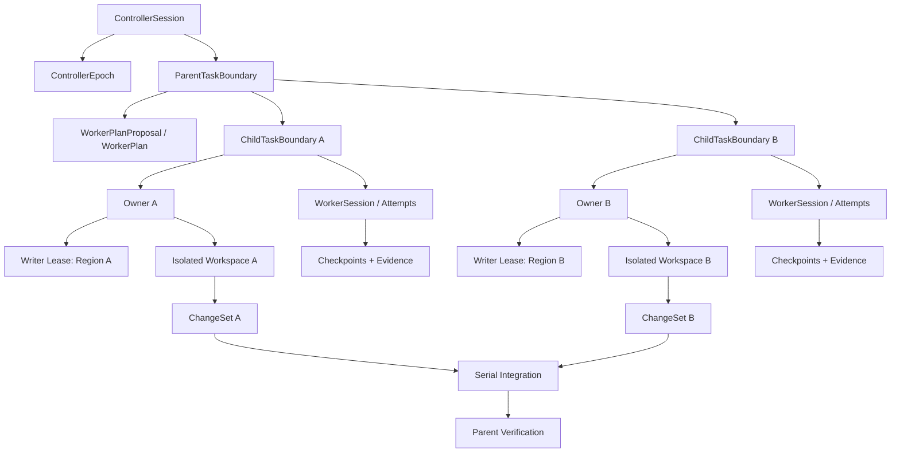
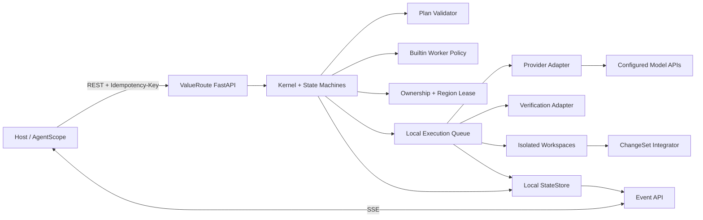

# ValueRoute：详细设计与需求规格

> 项目名称：ValueRoute  
> Python 包名 / 服务名：`valueroute`  
> 文档状态：实施基线 / 可进入 v0.0.1 开发  
> 版本：0.7  
> 日期：2026-08-14  
> 产品形态：独立 FastAPI 编排服务  
> 首个集成目标：AgentScope / 循智共创 Framework Adapter

## 0. 本版决策与修改记录

本版是完整覆盖后的实施基线，不保留旧工作名称和旧首版范围。核心决策如下：

1. 项目正式命名为 **ValueRoute**，不再使用其他项目代号。
2. ValueRoute 是独立 FastAPI 服务，不嵌入单一宿主进程；宿主通过 API、事件流和 Framework Adapter 接入。
3. v0.0.1 先实现同厂商 Worker 编排和安全内核，不在首个版本同时实现自动主控选择、跨厂商执行和公共插件生态。
4. v0.0.1 不使用任何数据库、中间件或远程状态服务。状态、事件、检查点、证据和幂等记录均写入用户本地数据目录。
5. 本地追加日志是事实源，原子快照用于读取和恢复；通过单实例文件锁、版本检查和原子提交保证单机正确性。
6. 一个父任务可以拆成多个互不重叠的子任务，每个子任务有独立所有者。每个所有者只修改、自审和验证自己拥有的代码区域。
7. Writer Lease 从“整文件互斥”升级为“可证明不重叠的区域租约”。同一文件、目录、数据库表或外部对象的不同区域可以并行修改。
8. ValueRoute 不内置 Token、费用和执行时长的数值默认上限；配置为空表示 ValueRoute 不额外限制，但仍受厂商、模型、组织策略和用户取消约束。
9. 单个 ControllerSession 内同时运行的 Worker 最多 5 个；委派深度为 1。
10. Checkpoint 使用事件驱动策略，不设置统一固定时间周期。
11. `Unobserved` 是证据观察状态，不是任务终态。任务终态和证据状态分开建模。
12. v0.0.1 不再拆成多个子版本。P0 是发布阻断项；P1 及以后能力不进入 v0.0.1，但保留清晰接口边界。
13. 宿主 Controller 提交语义拆分提案；ValueRoute 只做确定性校验、调度、隔离写入、集成和父级验收。
14. Owner 在隔离工作区中修改并提交 ChangeSet。ValueRoute 校验实际 Diff 与 Lease 后串行集成，使 Writer Lease 真正约束写入。

---

## 1. 执行摘要

ValueRoute 解决的是长会话和复杂任务中的模型与子代理编排问题：用户不需要理解每个模型的边界，也不需要手工决定是否创建 Worker、创建几个、使用哪个模型档位或何种思考强度。系统在明确任务边界、数据权限、写入区域和验证要求后，决定由当前主控直接执行，还是把可独立验收的子任务交给一个或多个 Worker。

ValueRoute 的核心价值不是“能创建多个代理”，而是把以下能力做成独立、可执行、可恢复、可审计的服务协议：

- 一个会话任意时刻只有一个活动主控；
- 一个可写子任务任意时刻只有一个所有者；
- 多个所有者可以并行修改同一资源的不同、可证明不重叠区域；
- Worker 的范围、权限、数据、并发和停止条件由运行时强制；
- 中断后可以从检查点恢复，不重复完整探索或重复写入；
- 测试、真实验证和未观察项进入结构化证据账本；
- 所有模型调用、重试、交接和验证成本完整记录；
- 自动化能力逐步开放，宿主可以保留主控决策权。

一句话定位：

> ValueRoute 是一个独立的有界代理编排服务：先保证任务、所有权、区域写入、恢复和证据正确，再逐步提供模型画像、主控选择和跨厂商路由。

## 2. 产品目标、非目标与成功定义

### 2.1 产品目标

1. 为 AgentScope 等宿主提供稳定的任务编排服务，而不是要求每个宿主重复实现所有权、恢复和证据逻辑。
2. 支持主控直接执行或创建 0–5 个 Worker，并按任务可分解性和区域冲突决定串行或并行。
3. 允许前端、后端或其他不重叠代码区域分别绑定所有者，同时保证每个所有者只修改和自审自己的区域。
4. 在单机进程重启、Worker 中断、API 重试和网络超时后维持幂等、唯一所有权和可恢复状态。
5. 提供完整的调用、费用、Token、延迟、状态、证据和数据外发轨迹。
6. 允许宿主从只使用安全内核逐步升级到 Worker 自动规划、路由建议和完整自动路由。
7. 以可复现实验验证自适应 Worker 是否在质量、成本或延迟上优于合理基线。

### 2.2 非目标

- v0.0.1 不自动切换主控模型。
- v0.0.1 不执行跨厂商任务交接。
- v0.0.1 不开放第三方决策插件、Transport 或 StateStore 注册。
- v0.0.1 不训练学习型路由策略。
- v0.0.1 不提供独立完整管理后台；以 OpenAPI、事件流、调试 API 和宿主界面为主要入口。
- 不做多个代理同时修改同一区域后再解决冲突的乐观合并。
- 不用独立代码审查代理替代任务所有者的自审和验证。
- 不保存或迁移模型私有思维链。
- 不承诺所有任务都优于最强单模型。
- 不把普通 fallback、负载均衡或模型可用性探测宣传成智能任务路由。

### 2.3 成功定义

v0.0.1 成功必须同时满足：

- 一个真实代码任务可以被拆成前端和后端两个不重叠子任务并安全并行；
- 同一区域的第二个写入租约会被拒绝；
- FastAPI 重启后，任务、所有权、租约、检查点和证据可由本地日志恢复；
- 重复 API 请求不会重复创建任务、Worker 或写操作；
- Worker 的 `Partial`、`Blocked` 和未观察证据不会被主控改写为完成；
- 所有模型调用的模型、Token、费用、延迟、重试和结果状态可追踪；
- 相对固定单代理和固定一个 Worker 基线，可以报告真实的质量、成本和延迟差异。

## 3. 目标用户、角色和典型场景

### 3.1 目标用户

- 在 AgentScope、Codex、Claude Code 风格环境中处理开发任务的用户；
- 构建企业内部智能体平台并需要限制写入、厂商和数据边界的团队；
- 研究模型路由、上下文管理、代理并行和恢复机制的开发者；
- 希望通过 API 把编排能力接入现有 Agent 系统的平台工程团队。

### 3.2 服务角色与权限

| 角色 | 主要权限 | 禁止行为 |
|---|---|---|
| Integrator | 创建会话和任务、提交宿主主控、订阅事件 | 修改组织安全策略 |
| Operator | 查看运行状态、取消、暂停、恢复、处理隔离状态 | 查看未授权的任务正文 |
| Policy Admin | 配置厂商、数据等级、模型清单、并发和组织上限 | 直接修改任务证据和终态 |
| Auditor | 只读查看决策、租约、数据外发、用量和证据 | 创建或执行任务 |
| Task Owner | 执行被分配的子任务，修改、自审和验证拥有区域 | 修改、Review 或批准其他所有者区域 |

首版认证可以由宿主提供受信任身份头或服务令牌。ValueRoute 不自行实现完整企业身份系统，但必须在内部统一为 `principal_id`、`tenant_id`、`roles` 和 `scopes`。

### 3.3 典型场景

1. 一个代码问题同时需要后端根因修复和前端复现。主控建立一个父任务，再创建前端、后端两个 ChildTaskBoundary。两个所有者分别修改、自审和验证自己的区域；共享协议文件若被双方需要，则拆出第三个串行子任务或归并给一个所有者。
2. 一个简单文案修改由主控直接完成，Worker 数为 0。
3. 一个复杂但无法证明写入区域不重叠的重构只绑定一个所有者串行执行。
4. 一个任务修改同一文件中的两个独立函数。若 AST 定位、基准版本和区域冲突检测均成功，可为两个函数分别发放区域租约；否则退化为整文件独占。
5. 一个数据库修复同时更新同一表中两个不相交主键集合，可以并行；Schema、索引或迁移变更必须取得表级独占租约。
6. Worker 在验证失败后进程退出。进程恢复后，调度器从最近安全 Checkpoint 创建续接 Attempt，并保留原失败证据。

## 4. 统一术语与领域对象

### 4.1 对象层级



### 4.2 核心对象定义

| 对象 | 定义 | 唯一性 / 不变量 |
|---|---|---|
| ControllerSession | 宿主中的连续主控会话在 ValueRoute 内的映射 | 同一时刻最多一个活动 ControllerEpoch |
| ControllerEpoch | provider、model、snapshot 和 effort 固定的一段主控时期 | 激活后绑定字段不可原地修改 |
| ParentTaskBoundary | 用户可见、可整体验收的目标 | 可以包含多个子任务，不直接拥有多个写入者 |
| WorkerPlanProposal | 宿主 Controller 提交的语义拆分提案 | 校验通过前不可执行 |
| WorkerPlan | 已验证、可调度的子任务和依赖关系 | Worker 不超过 5，冲突写入必须串行 |
| ChildTaskBoundary | 可以独立执行、独立验收、具有明确区域的子目标 | 同一时刻最多一个 owner |
| OwnerAssignment | 子任务与唯一 Task Owner 的绑定 | 转移前必须 checkpoint 并释放租约 |
| ResourceRegion | 对文件、目录、数据库或外部对象中可写区域的稳定描述 | 必须带资源版本或等价并发控制信息 |
| WriterLease | Owner 对一个 ResourceRegion 的临时写入权 | 与现有有效租约不重叠才可授予 |
| WorkspaceSnapshot | 规范工作区在任务开始时的可验证基准 | 由 revision 和内容哈希标识 |
| ChangeSet | Owner 在隔离工作区产生的实际变更集合 | 每个变更必须落在其有效 Lease 内 |
| IntegrationAttempt | 将 ChangeSet 合入规范工作区的一次串行尝试 | 失败不覆盖旧状态，由原 Owner 修复 |
| ParentVerification | 全部集成后对父任务验收合同的验证 | 不替代 Owner 自审，不改变代码所有权 |
| WorkerSession | 同一子任务和所有者的可恢复工作上下文 | 中断后续接，不自动换 owner |
| WorkerAttempt | WorkerSession 的一次具体执行 | 每次重试单独记录，不覆盖旧失败 |
| Checkpoint | 已确认事实、文件状态、证据和下一步的持久化快照 | 不保存私有思维链 |
| EvidenceRecord | 测试、静态检查、真实验证或人工确认的结果 | 包含来源、时间、观察状态和引用 |
| AuditEvent | 不可变的领域事件 | 只追加，不覆盖历史事件 |

### 4.3 ParentTaskBoundary 与 ChildTaskBoundary

```yaml
parent_task_boundary:
  id: pt_123
  version: 1
  goal: 修复上传状态并恢复前端正确展示
  acceptance_evidence:
    - 后端真实上传达到 ready
    - 前端可见状态从 pending 更新为 ready
  child_task_ids: [ct_backend, ct_frontend]
  status: running

child_task_boundary:
  id: ct_backend
  parent_task_id: pt_123
  version: 1
  objective: 修复后端状态更新链路
  in_scope:
    - backend/upload/**
  out_of_scope:
    - frontend/**
  allowed_read_scope:
    - repository
    - approved_logs
  requested_write_regions: []
  acceptance_evidence:
    - 修复前用例暴露 pending 问题
    - 修复后目标用例通过
    - 真实上传结果已观察或明确标记未观察
  stop_conditions:
    - acceptance_met
    - cancelled
    - blocked
    - provider_failure
```

父任务状态由子任务结果和父级验收器计算。主控不能因为全部子任务返回 `complete` 就直接把父任务标为完成；父级验收证据仍必须满足。

## 5. 系统总体架构

### 5.1 独立服务架构



### 5.2 本地持久化原则

v0.0.1 是用户本机上的单实例服务。它不要求用户安装数据库，也不连接远程状态服务。

持久化必须满足：

1. journal 是唯一事实源，只追加已提交事件；
2. snapshot 是可丢弃的派生缓存，可由 journal 重建；
3. 每次业务提交先校验对象版本，再原子追加一个 commit frame；
4. 同一数据目录只能由一个 ValueRoute 进程取得排他文件锁；
5. Checkpoint、Evidence、Artifact 使用内容哈希校验；
6. 崩溃产生的不完整日志尾部不得被当作已提交状态；
7. SSE 使用持久化全局序号恢复，不依赖内存广播历史。

本地状态不保存 provider-native 私有推理状态、API key 明文或未经授权的完整聊天历史副本。

### 5.3 数据目录

数据根目录由 `VALUEROUTE_DATA_DIR` 指定。未指定时使用操作系统标准用户数据目录，不默认写入代码仓库。

```text
valueroute-data/
├── instance.lock
├── journal/
│   ├── active.jsonl
│   └── segments/
├── snapshots/
│   ├── manifest.json
│   └── aggregates/
├── checkpoints/
├── evidence/
├── idempotency/
├── artifacts/
├── workspaces/
└── quarantine/
```

日志分段、快照和清理都是本地文件操作。压缩只能删除已被校验快照覆盖、且超过保留策略的旧日志段。

### 5.4 单进程运行拓扑

v0.0.1 使用一个 FastAPI 进程，进程内包含 API、调度器和受限执行池。长模型任务不占用请求协程。

单进程设计使文件锁、CAS 版本检查和进程内调度足以提供首版不变量。第二个实例指向同一数据目录时必须启动失败并返回明确诊断。

本版不宣称多机、多实例或网络文件系统正确性。未来实现其他存储只允许替换适配器，不得改变领域语义和 API 契约。

### 5.5 核心模块

| 模块 | 职责 | 不负责 |
|---|---|---|
| API Layer | 请求校验、认证映射、幂等和响应 | 在请求线程内执行长任务 |
| Session Manager | ControllerSession 和 Epoch 生命周期 | 替模型理解用户需求 |
| Boundary Manager | 父子任务、范围、验收和版本 | 自动扩大任务范围 |
| Ownership Manager | OwnerAssignment 和转移 | 代码 Review 代理接力 |
| Region Resolver | 把符号、路径、主键或子资源解析成 ResourceRegion | 猜测无法证明的区域独立性 |
| Lease Manager | 冲突检测、授予、续租、释放和回收 | 用“最后合并”处理重叠写入 |
| Plan Validator | 校验宿主的 WorkerPlanProposal、任务边界和验收合同 | 开放式理解用户需求 |
| Worker Policy | 在已校验提案内决定 0–5 个 Worker 和串并行关系 | 擅自发明语义子任务 |
| Executor | 调度 attempt、调用模型和工具、写 checkpoint | 直接修改领域终态 |
| Workspace Manager | 创建 Owner 隔离工作区和基准快照 | 允许 Worker 直写规范工作区 |
| ChangeSet Integrator | 校验 Diff、按序集成并记录冲突 | 替 Owner 修改越界代码 |
| Checkpoint Store | 保存恢复所需事实、状态和下一步 | 保存私有思维链 |
| Evidence Gate | 校验客观证据和观察状态 | 把局部 passed 等同父任务完成 |
| Provider Adapter | 统一请求、usage、错误和取消语义 | 隐藏厂商差异或伪造 usage |
| Framework Adapter | 映射宿主会话、任务、权限和事件 | 把核心绑定到 AgentScope |
| Audit Ledger | 追加领域事件、调用和状态变更 | 覆盖失败历史 |
| Local StateStore | journal、snapshot、CAS、恢复和压缩 | 提供多实例协调 |

## 6. 运行模式与版本边界

### 6.1 四种长期模式

| 模式 | Profiler | 主控选择 | Worker 规划 | Worker 模型选择 | 版本 |
|---|---|---|---|---|---|
| `off` | 关闭 | 宿主决定 | 宿主决定 | 宿主决定 | v0.0.1 |
| `worker_only` | 关闭 | 宿主决定 | 宿主提案、ValueRoute 校验调度 | ValueRoute 按清单选择 | v0.0.1 |
| `advisory` | 开启 | 只建议 | 只建议 | 只建议 | v0.0.2 |
| `automatic` | 开启 | 自动 | 自动 | 自动 | v0.1 |

`off` 不是关闭安全内核。宿主提交主控和 Worker 计划后，ValueRoute 仍执行边界、所有权、区域租约、并发、检查点、证据和终态校验。

`worker_only` 是首版主要路径。主控由宿主登记并保持不变。宿主提交语义拆分提案，ValueRoute 校验边界、冲突、验收、并发和模型策略后决定是否执行。

### 6.2 v0.0.1 明确范围

包含：

- FastAPI 独立服务；
- OpenAI 单厂商 Provider Adapter；
- AgentScope Framework Adapter；
- `off` 和 `worker_only`；
- 宿主主控登记，不自动切换；
- 0–5 个同厂商 Worker；
- `WorkerPlanProposal` 校验和内置规则型 Worker Policy；
- Parent/Child TaskBoundary；
- 单一 Owner、隔离工作区、区域 Writer Lease、ChangeSet 集成和父任务验证；
- Checkpoint、Evidence、Audit、取消、恢复和幂等；
- 本地 journal、snapshot、checkpoint、evidence 和 artifact 持久化；
- `StateStore`、`ArtifactStore`、`WorkspaceAdapter` 和 `ExecutionQueue` 接口；
- OpenAPI、SSE 事件和调试查询。

不包含：

- 自动主控选择和 ControllerEpoch 自动切换；
- 跨厂商 Handoff；
- 第三方公共插件 API；
- 学习型 Ranking Policy；
- 独立完整 Web 管理后台；
- T2/T3 跨厂商写入能力；
- 数据库、中间件、多实例和分布式调度。

## 7. 请求、主控与上下文

### 7.1 请求类型

长期支持：

- `new_task`：新的父级可验收目标；
- `material_amendment`：范围、验收、数据、工具、预算或权限发生实质变化；
- `continuation`：在现有边界内继续；
- `clarification`：回答待确认问题或查询状态；
- `control`：取消、暂停、恢复、固定主控、查看轨迹。

v0.0.1 由 Framework Adapter 提供结构化类型，ValueRoute 校验后使用；不在首版使用模型完成开放式 RequestClassifier。

### 7.2 ControllerSession

```yaml
controller_session:
  id: cs_123
  tenant_id: tenant_1
  host_session_id: host_456
  active_controller_epoch_id: ce_1
  orchestration_mode: worker_only
  max_active_workers: 5
  token_budget: null
  cost_budget_usd: null
  time_budget_seconds: null
  created_at: timestamp
```

`active_controller_epoch_id` 在主控尚未登记时允许为 `null`。`off` 和 `worker_only` 执行任务前必须由宿主登记主控；ValueRoute 不随机选取默认模型。

### 7.3 ControllerEpoch

```yaml
controller_epoch:
  id: ce_1
  controller_session_id: cs_123
  provider_id: openai
  model_id: manifest-model-id
  model_snapshot: recorded-or-null
  reasoning_effort: provider-supported-value
  status: active
  activated_at: timestamp
  retired_at: null
```

v0.0.1 只允许宿主登记首个 Epoch，不自动切换。显式替换主控不属于首版。接口仍保留 `expected_version`，避免未来扩展破坏并发语义。

### 7.4 Worker Task Capsule

主控只向 Worker 发送完成子任务所需的最小上下文：

- ChildTaskBoundary 和版本；
- 可读、可写区域和禁止范围；
- 用户明确约束；
- 必要文件、符号、日志或产物引用；
- 已确认事实、已排除假设和最近 checkpoint；
- 可用工具和权限；
- 模型、effort 和可选预算；
- 返回 Schema 和停止条件。

摘要不确定的内容标记为 `unknown`。Worker 不接收无关完整历史，也不能从 Task Capsule 推导更大的写入权限。

### 7.5 WorkerPlanProposal 与确定性校验

v0.0.1 不使用 Profiler，也不从开放式自然语言自动推导可靠任务图。语义拆分责任属于宿主 Controller。

宿主提交：

```yaml
worker_plan_proposal:
  parent_task_id: pt_123
  expected_parent_version: 1
  children:
    - client_ref: backend
      objective: 修复后端状态更新链路
      depends_on: []
      read_scope: [repository]
      write_regions: ["directory:backend/upload/"]
      acceptance_contract:
        required: ["目标回归测试通过"]
      requested_model_profile: default_worker
  integration_order: [backend]
```

ValueRoute 校验：

- 子任务目标、输入、停止条件和必要验收项是否完整；
- 子任务之间是否存在职责重叠或循环依赖；
- write region 是否可解析，冲突区域是否明确串行；
- 每个写子任务是否只有一个 Owner；
- Worker 总数是否为 0–5，委派深度是否为 1；
- Provider、模型、工具和数据等级是否符合策略；
- 集成顺序是否覆盖全部 ChangeSet。

校验返回 `PlanValidationResult`，包含稳定问题码、JSON Pointer 和修复建议。仅无 error 的提案才能固化为 `WorkerPlan`。

```yaml
plan_validation_result:
  valid: false
  proposal_hash: sha256
  issues:
    - severity: error | warning
      code: region_overlap
      path: /children/1/write_regions/0
      message: string
      remediation: serialize_after:backend
  normalized_plan_id: null
```

## 8. 所有权、Review 与并行规则

### 8.1 所有权不变量

1. 一个 ChildTaskBoundary 同一时刻最多一个 OwnerAssignment。
2. 一个 ParentTaskBoundary 可以包含多个 ChildTaskBoundary，因此可以有多个所有者。
3. 每个所有者只修改、自审、测试和验证自己拥有的区域。
4. 所有者可以读取依赖代码，但不得修改、Review、批准或接管其他所有者的区域。
5. 主控只检查任务合同、区域、状态和证据完整性，不对所有者代码做重复逐行 Review。
6. 其他所有者发现问题时只能提交 `cross_boundary_finding`，由主控转交对应所有者或建立新子任务。
7. 所有权转移必须先 checkpoint、停止旧 attempt、释放 Writer Lease，再创建新 OwnerAssignment。
8. Worker 不得继续创建 Worker，委派深度固定为 1。

### 8.2 为什么允许同一资源不同区域并行

整文件互斥会让前端、后端或大型模块中的独立修改失去并行价值。ValueRoute 允许区域级并行，但判断标准不是代理自报“不会冲突”，而是由 ResourceRegion、基准版本和确定性重叠规则证明不重叠。

不能证明不重叠时，系统必须：

1. 合并为一个子任务和一个所有者；或
2. 串行执行多个子任务；或
3. 提升租约粒度为整文件、整目录、整表或整个外部对象。

### 8.3 Writer Lease 数据结构

```yaml
writer_lease:
  id: lease_123
  child_task_id: ct_backend
  owner_agent_id: worker_7
  resource_kind: file | directory | database | external
  resource_id: stable-resource-id
  base_revision: git-blob-sha-or-version
  selector_type: symbol | ast_node | path_prefix | row_keys | key_range | partition | json_pointer | provider_subresource | whole_resource
  selector_value: structured-value
  mode: write
  status: active | released | expired | revoked
  acquired_at: timestamp
  expires_at: timestamp
  heartbeat_at: timestamp
```

### 8.4 各资源的区域粒度

#### 代码和文本文件

优先级：

1. 语言解析器提供的稳定符号：类、函数、方法、组件、声明；
2. AST 节点及其内容哈希；
3. JSON Pointer、YAML 路径或其他结构化路径；
4. 整文件。

行号只用于展示，不作为稳定租约主键，因为前序修改会导致行号漂移。纯文本无法稳定解析时使用整文件租约。

同一文件的两个符号租约可以并存，但以下情况冲突：

- 一个租约是整文件；
- 符号范围包含或交叉；
- 两个符号共享必须同步修改的声明、导入或注册表；
- base revision 不一致且无法重新解析；
- 任一 selector 无法确定性解析。

#### 目录

目录以规范化绝对工作区 ID 加相对路径表示。不同子路径可以并行；父路径租约覆盖所有后代。目录重命名、批量格式化、生成器输出和依赖锁更新使用父级独占租约。

#### 宿主数据库资源

这里描述的是 Worker 可能操作的宿主业务资源，不是 ValueRoute 的内部持久化方式。ValueRoute 自身在 v0.0.1 不使用数据库。

允许的粒度：主键集合、确定性键范围、分区和整表。以下操作必须表级或数据库级独占：

- Schema 迁移；
- 索引创建、删除或重建；
- 约束修改；
- 无确定性筛选条件的批量更新；
- 会改变其他租约键空间含义的操作。

#### 外部对象

资源 ID 使用 `provider + object_type + object_id`，区域使用受 Provider Adapter 注册的 subresource，例如 Issue 的 `title`、`body`、`labels`、`comments/{id}`。未注册子资源语义时退化为整个对象独占。

### 8.5 冲突判定与 Lease 提交

Lease Manager 在进程内提交临界区中：

1. 规范化 resource 和 selector；
2. 读取当前资源版本和有效租约集合；
3. 运行按资源类型注册的 `overlaps(a, b)`；
4. 使用 `expected_version` 提交租约事件；
5. 若版本已变化，重新读取并再次判断；
6. journal 落盘成功后才返回 Lease；
7. 任何未知或无法解析的重叠关系均拒绝。

所有者提交修改前必须重新校验 `base_revision`。若资源版本变化：

- 能重新解析且区域仍不重叠：更新租约 revision 后继续；
- 区域发生交叉或语义无法确认：停止写入并返回 `lease_revision_conflict`；
- 禁止直接覆盖最新资源。

### 8.6 隔离工作区与 ChangeSet

Writer Lease 不能只停留在状态记录。每个 Owner 必须在独立工作区执行，不能直接写规范工作区。

执行流程：

1. `WorkspaceAdapter` 从同一 `WorkspaceSnapshot` 创建 Owner 工作区；
2. Owner 的写工具只能访问该工作区；
3. 完成后生成包含 base revision、文件哈希和实际 Diff 的 `ChangeSet`；
4. ValueRoute 将每个实际变更重新解析为 ResourceRegion；
5. 任一变更不在有效 Lease 内，整个 ChangeSet 拒绝并记录 `write_scope_violation`；
6. 校验通过的 ChangeSet 进入父任务集成队列。

首个 `WorkspaceAdapter` 使用本地目录或 Git worktree。具体机制取决于宿主工作区能力，但隔离、基准 revision 和 Diff 校验是强制合同。

首版代码工作区优先要求 Git：每个 Owner 使用独立 worktree，集成发生在专用 integration worktree，规范结果由 `refs/valueroute/tasks/{task_id}` 指向的 commit 表示。只有完整 commit 成功后才原子更新 ref。

用户当前工作树不在 Worker 执行期间被直接覆盖。最终结果由宿主显式采纳。非 Git 目录适配器必须以副本构建新 revision，并通过原子 manifest 指针切换；不能逐文件写一半后宣称集成成功。

### 8.7 串行集成与父级验证

ChangeSet 按 `WorkerPlan.integration_order` 串行合入规范工作区。每次集成前重新校验基准 revision 和目标区域。

冲突时创建失败的 `IntegrationAttempt`，保持规范工作区处于上一个已提交状态，并把问题退回该 ChangeSet 的原 Owner。Controller 或其他 Owner 不代改。

全部 ChangeSet 集成后运行 `ParentVerification`。它只验证父任务验收合同和整体行为，不进行 Owner 级逐行代码 Review。

## 9. Worker 生命周期、并发和 Checkpoint

### 9.1 Worker 并发

- 单个 ControllerSession 同时处于 `running` 的 WorkerAttempt 最多 5 个。
- 单个 ParentTaskBoundary 创建的活动 WorkerSession 总数最多 5 个。
- 主控和 Profiler 不计入 Worker 数，但服务部署可以另外限制全部模型调用并发。
- 服务全局并发由部署配置决定；达到容量时任务进入持久化本地队列，不自动突破会话上限。
- 并发上限不能由模型或插件修改。

### 9.2 WorkerSession 与 WorkerAttempt

WorkerSession 汇总同一 Owner 对同一子任务的连续工作：

```text
created → active → completed | partial | blocked | failed | cancelled
```

WorkerAttempt 表示一次实际执行：

```text
queued → claimed → running → waiting_approval | pause_requested | cancel_requested
waiting_approval → running | cancelled | failed
pause_requested → paused
cancel_requested → cancelled | failed
paused → queued | cancelled
running → succeeded | partial | blocked | failed
```

`claimed` 带 claim token 和 TTL。进程启动恢复时，旧 claim 一律视为失效；只有存在安全 Checkpoint 的 Attempt 才重新进入 `queued`。

同一 WorkerSession 任意时刻最多一个非终态 Attempt。恢复创建新 Attempt 时必须引用被终结的 Attempt 和恢复 Checkpoint，不能覆盖旧失败历史。

### 9.3 Checkpoint 策略

ValueRoute 不设置统一的分钟数或 Token 周期。Checkpoint 由任务风险和事件触发。

强制触发：

1. 所有者确认实施计划和写入区域后；
2. 第一次实际写入前；
3. 所有权或 Writer Lease 转移前；
4. 关键测试或真实验证失败后；
5. 请求暂停、取消、超时或服务准备关闭时；
6. 主控显式切换前；
7. Worker 或任务进入终态前。

可选触发：

- 长任务由 Task Policy 设置时间、工具调用次数或修改次数阈值；
- Provider Adapter 在可安全截断的响应边界写入；
- 宿主显式请求保存。

Checkpoint 至少包含：

- boundary 和 owner 版本；
- 已确认事实和未决问题；
- 当前资源 revision、租约和修改摘要；
- 已执行命令和证据引用；
- 最近失败及下一步；
- 已使用 Token、费用和时间；
- 是否可以安全恢复。

### 9.4 Worker 返回契约

```yaml
worker_result:
  status: completed | partial | blocked | failed | cancelled
  child_task_id: ct_backend
  boundary_version: 1
  owner_agent_id: worker_7
  root_cause: confirmed-description-or-unknown
  changes:
    - resource_id: workspace:file.py
      region: symbol:handle_upload
      purpose: 与子任务目标的直接关系
  evidence_ids: [ev_1, ev_2]
  unobserved_items: []
  cross_boundary_findings: []
  usage:
    input_tokens: 0
    output_tokens: 0
    cost_usd: null
    wall_time_ms: 0
  stop_reason: acceptance_met | cancelled | blocked | provider_failure | verification_failed
  checkpoint_id: cp_9
```

## 10. 预算、费用、时间和停止规则

### 10.1 不设置内置数值默认值

以下字段允许为 `null`：

```yaml
budgets:
  max_input_tokens: null
  max_output_tokens: null
  max_total_tokens: null
  max_cost_usd: null
  max_wall_time_seconds: null
```

`null` 的精确定义是“ValueRoute 不额外施加该项数值限制”，不是“模型无限运行”。仍然存在：

- 厂商和模型上下文限制；
- Provider API 超时与错误；
- 组织可选安全上限；
- 会话并发上限 5；
- 委派深度 1；
- TaskBoundary 停止条件；
- 用户或宿主取消；
- 服务运维级熔断和关闭。

配置优先级为：任务级 > 会话级 > 组织级 > 未设置。组织可配置紧急上限，但 ValueRoute 发布包不写死 Token、费用或时长数值。

### 10.2 运行保护不是用户预算

即使 Token、费用和任务总时长未设置，服务仍必须提供防止永久挂起和本地磁盘耗尽的技术保护：

- 单次 Provider 请求超时；
- Provider 重试次数或重试窗口；
- Worker 心跳超时；
- Attempt claim TTL 与 Writer Lease TTL；
- 取消宽限时间，超时后强制终结本地执行；
- 单次响应、Checkpoint、Evidence 和 Artifact 的最大字节数；
- journal 分段、保留、压缩和磁盘余量阈值。

这些值由配置 Schema 提供安全默认值并可由部署者调整。它们限制单次技术操作，不得被产品文案描述成用户任务预算。

### 10.3 成本记录始终强制

即使没有费用上限，ValueRoute 仍必须记录：

- 输入、缓存输入、输出和推理 Token；
- 厂商返回的 usage；
- 价格表版本和估算费用；
- 重试、失败、Checkpoint、验证和路由调用成本；
- 无法计算时使用 `cost_status: unknown`，不得写成 0。

## 11. 任务状态、证据与诚实终态

### 11.1 ParentTask 与 ChildTask 状态

```text
draft → planned → queued → running
running → waiting_approval | pause_requested | cancel_requested
pause_requested → paused
cancel_requested → cancelled | failed
waiting_approval → running | cancelled | blocked
paused → queued | cancelled
running → completed | partial | blocked | failed
```

终态定义：

| 状态 | 含义 |
|---|---|
| completed | 当前边界的全部必要验收证据已满足 |
| partial | 完成了可交付部分，但至少一个必要条件未满足 |
| blocked | 权限、审批、外部依赖或必要信息阻塞 |
| failed | 执行或验证失败，且当前 attempt 无可安全继续路径 |
| cancelled | 用户、宿主或运维明确取消 |

ChildTask 的 `completed` 表示其自身验收合同满足且 ChangeSet 已准备好，不代表父任务完成。

ParentTask 只有在全部必要 ChangeSet 集成成功且 `ParentVerification` 通过后才能为 `completed`。子任务结果与父状态汇总规则如下：

| 条件 | ParentTask 结果 |
|---|---|
| 用户取消已完成 | `cancelled` |
| 存在必要阻塞且当前无法推进 | `blocked` |
| 执行或集成失败且无安全继续路径 | `failed` |
| 有可交付结果但必要验收未满足 | `partial` |
| 全部必要子任务、集成和父验收通过 | `completed` |

### 11.2 ObservationStatus

`Unobserved` 不再作为任务终态。每条验收项单独记录观察状态：

```yaml
evidence_record:
  id: ev_1
  requirement_id: acceptance_1
  evidence_type: test | static_check | live_check | artifact | human_confirmation
  observation_status: observed_pass | observed_fail | unobserved | not_applicable
  source: command-or-adapter
  artifact_ref: uri-or-null
  recorded_at: timestamp
```

存在必要 `unobserved` 时，任务最多为 `partial` 或 `blocked`，不得为 `completed`。

### 11.3 测试完整性

ValueRoute 需要检测并标记：

- 削弱断言；
- 新增 skip、xfail、注释或删除相关测试；
- 用与目标行为无关的 mock 替代真实 I/O；
- 只测试实现细节，不测试可观察行为；
- 未保留修复前关键失败；
- 为通过测试进行范围外重构。

这些行为进入 `test_integrity_review_required`。它不是一律禁止，但所有者必须提供与当前边界直接相关的理由，Evidence Gate 才能接受。

### 11.4 其他状态机与迁移约束

| 对象 | 当前状态 | 事件 / 前置条件 | 目标状态 | 失败处理 |
|---|---|---|---|---|
| WorkerAttempt | queued | capacity available | claimed | 保持 queued |
| WorkerAttempt | claimed | claim token 有效 | running | claim 过期后恢复检查 |
| WorkerAttempt | running | approval requested | waiting_approval | 持久化审批和 checkpoint |
| WorkerAttempt | running | pause requested | pause_requested | 等待安全边界 |
| WorkerAttempt | pause_requested | checkpoint durable | paused | checkpoint 失败则 failed |
| WorkerAttempt | running | cancel requested | cancel_requested | 发出 Provider/工具取消 |
| WorkerAttempt | cancel_requested | 执行已停止 | cancelled | 宽限期后强制终结 |
| WriterLease | requested | 不重叠且版本匹配 | active | overlap/revision conflict |
| WriterLease | active | heartbeat | active | journal 失败则不续租 |
| WriterLease | active | release/TTL/revoke | released/expired/revoked | 终态不可恢复 |
| IntegrationAttempt | queued | ChangeSet 和 Lease 校验通过 | running | rejected |
| IntegrationAttempt | running | 原子应用成功 | integrated | 回滚到前一规范 revision |
| IntegrationAttempt | running | revision/merge conflict | conflicted | 返回原 Owner |
| Approval | pending | authorized approve | approved | 无权限则拒绝请求 |
| Approval | pending | authorized reject/expiry | rejected/expired | Attempt 转 blocked/cancelled |

所有迁移都必须携带 `expected_version`，在同一个本地 commit frame 中写入状态变化、领域事件和幂等结果。终态不可原地回退；重试创建新 Attempt 或 IntegrationAttempt。

## 12. API 设计

### 12.1 API 原则

- 前缀：`/v1`；
- 所有写请求使用 `Idempotency-Key`；
- 所有修改已有资源的请求携带 `expected_version`；
- 长任务不在 HTTP 请求线程内执行；
- 创建接口返回资源和当前状态，不等待模型完成；
- 状态变化通过 SSE 提供；
- 错误使用稳定 `code`，不要求客户端解析自然语言；
- 取消是持久化请求，不等同于 HTTP 连接断开。

公共响应使用一致 Envelope：

```yaml
data: {}
meta:
  request_id: req_123
  resource_version: 3
  event_sequence: 108
error: null
```

错误响应：

```yaml
data: null
meta: {request_id: req_123}
error:
  code: version_conflict
  message: 资源已变化
  details:
    expected_version: 2
    actual_version: 3
    field_errors: []
  retryable: true
```

### 12.2 核心端点

| 方法 | 路径 | 用途 |
|---|---|---|
| POST | `/v1/controller-sessions` | 创建会话 |
| POST | `/v1/controller-sessions/{id}/epochs` | 登记首个主控；首版不允许切换 |
| GET | `/v1/controller-sessions/{id}` | 查询当前主控和模式 |
| POST | `/v1/tasks` | 创建父任务和初始边界 |
| GET | `/v1/tasks/{id}` | 查询任务、子任务和汇总状态 |
| POST | `/v1/tasks/{id}/plan` | 提交并校验 WorkerPlanProposal |
| POST | `/v1/tasks/{id}/execute` | 提交执行 |
| POST | `/v1/tasks/{id}/pause` | 请求暂停并写 checkpoint |
| POST | `/v1/tasks/{id}/resume` | 从可恢复 checkpoint 继续 |
| POST | `/v1/tasks/{id}/cancel` | 请求取消 |
| POST | `/v1/tasks/{id}/approvals/{approval_id}` | 批准或拒绝高风险动作 |
| GET | `/v1/tasks/{id}/events` | SSE 事件流 |
| GET | `/v1/tasks/{id}/evidence` | 查询证据和未观察项 |
| GET | `/v1/tasks/{id}/usage` | 查询 Token、费用和延迟 |
| GET | `/v1/leases` | 按任务、Owner 或资源查询租约 |
| GET | `/v1/health/live` | 进程存活 |
| GET | `/v1/health/ready` | 数据目录锁、journal、执行池和 Provider 配置就绪 |

表中端点是公共宿主合同。claim、heartbeat、Lease 续期、ChangeSet 应用、journal 管理和快照压缩只供进程内 application service 调用，v0.0.1 不暴露为远程 API。

### 12.3 核心请求 Schema

创建父任务：

```yaml
POST /v1/tasks
controller_session_id: cs_123
request_type: new_task | material_amendment | continuation
goal: string
acceptance_contract:
  - id: acc_1
    description: string
    required: true
data_classification: public | internal | confidential | restricted
workspace:
  adapter_id: local
  canonical_uri: workspace://project
  base_revision: string
budgets: {max_total_tokens: null, max_cost_usd: null, max_wall_time_seconds: null}
```

提交计划使用 7.5 节的 `WorkerPlanProposal`，并补充 `expected_parent_version`。成功返回 `WorkerPlan`、`PlanValidationResult` 和新的父任务版本；校验失败返回 `422 invalid_plan`。

执行与控制：

```yaml
POST /v1/tasks/{id}/execute
expected_version: 3
plan_id: wp_123

POST /v1/tasks/{id}/pause|resume|cancel
expected_version: 4
reason: string | null

POST /v1/tasks/{id}/approvals/{approval_id}
expected_version: 1
decision: approve | reject
reason: string | null
```

所有 ID、字符串长度、集合数量、URI scheme 和枚举都由版本化 JSON Schema 限制。未知字段默认拒绝，避免客户端拼写错误被静默忽略。

任务查询和创建响应中的 `data` 使用统一 `TaskView`：

```yaml
task_view:
  id: pt_123
  version: 4
  controller_session_id: cs_123
  status: running
  goal: string
  plan_id: wp_123
  child_tasks: []
  integration_status: pending | running | integrated | conflicted | rejected
  acceptance_summary: {passed: 1, failed: 0, unobserved: 1}
  latest_checkpoint_id: cp_9
  created_at: timestamp
  updated_at: timestamp
  links: {events: string, evidence: string, usage: string}
```

列表字段使用稳定对象 Schema，不返回无版本的自由文本字典。完整定义以仓库中的 `/schemas/v1/*.json` 为发布合同，并由 OpenAPI 引用同一 Pydantic 模型生成。

### 12.4 幂等语义

每个写请求保存：`tenant_id + endpoint + idempotency_key + request_hash + response_ref`。

- 同一 key、同一请求：返回原结果；
- 同一 key、不同请求体：返回 `idempotency_conflict`；
- 执行提交超时后重试：不得创建第二个 attempt；
- 幂等记录保留时间由部署数据生命周期策略配置。

幂等结果与业务事件必须在同一个 commit frame 中落盘。若进程在响应前退出，重试仍能从本地记录返回原结果。

### 12.5 并发版本控制

创建资源使用 `Idempotency-Key`。修改资源同时使用 `Idempotency-Key` 和请求体中的 `expected_version`。

- 版本匹配：提交事件并返回递增后的版本；
- 版本不匹配：返回 `409 version_conflict`，不执行部分写入；
- 客户端重新读取、重新决策后使用新 key 提交；
- 禁止 last-write-wins。

`POST /tasks/{id}/approvals/{approval_id}` 在审批仍为 pending 时更新；重复相同决定返回原结果，互斥决定返回冲突。

### 12.6 异步与审批语义

创建、计划、执行、暂停、恢复和取消返回 `202 Accepted` 或已形成的同步资源结果。`approval_required` 是执行状态，不作为普通错误。

等待审批时响应包含 `approval_id`、动作摘要、风险、到期时间和允许决定。审批正文不得包含密钥或未授权数据。

### 12.7 错误码

| code | HTTP | 含义 |
|---|---:|---|
| `invalid_boundary` | 422 | 边界或验收定义无效 |
| `invalid_plan` | 422 | WorkerPlanProposal 未通过确定性校验 |
| `idempotency_conflict` | 409 | key 已用于不同请求 |
| `version_conflict` | 409 | expected_version 与当前资源版本不一致 |
| `owner_conflict` | 409 | 子任务已有其他所有者 |
| `lease_overlap` | 409 | 请求区域与有效租约重叠 |
| `lease_revision_conflict` | 409 | 基准版本变化且无法安全重算 |
| `worker_limit_exceeded` | 409 | 会话或父任务已达到 5 个活动 Worker |
| `not_resumable` | 409 | 没有安全 checkpoint |
| `provider_unavailable` | 503 | Provider 或模型不可用 |
| `state_store_unavailable` | 503 | 本地 journal 无法安全提交 |
| `data_dir_locked` | 503 | 数据目录已被另一个实例占用 |
| `write_scope_violation` | 403 | ChangeSet 包含 Lease 外修改 |
| `integration_conflict` | 409 | ChangeSet 无法基于当前 revision 安全集成 |
| `policy_denied` | 403 | 组织、数据或权限策略拒绝 |

## 13. 事件模型

关键事件使用统一 Envelope：

```yaml
event:
  id: evt_uuid
  sequence: 123
  tenant_id: tenant_1
  aggregate_type: task
  aggregate_id: pt_123
  event_type: task.started
  occurred_at: timestamp
  actor_id: principal-or-system
  trace_id: trace_123
  payload: {}
```

`sequence` 是数据目录内全局单调递增的提交序号；事件另带 `aggregate_version`。客户端按 event id 去重，并用 `Last-Event-ID` 从 journal 补发。

内存广播只负责降低实时延迟。断线续传和服务重启后的历史事件一律读取持久化 journal。

首版事件：

- `session.created|controller_registered|controller_retired`；
- `task.created|planned|queued|started|paused|resumed|completed|partial|blocked|failed|cancelled`；
- `child_task.created|owner_assigned|owner_released|owner_transferred`；
- `plan.proposed|validated|rejected|committed`；
- `lease.requested|acquired|renewed|released|expired|conflicted`；
- `worker.queued|claimed|started|checkpointed|stopped`；
- `changeset.created|validated|rejected|integration_started|integrated|conflicted`；
- `provider.call_started|completed|failed|cancel_requested`；
- `test.failed_before|passed_after|integrity_flagged`；
- `evidence.recorded|rejected`；
- `budget.observed|limit_reached`；
- `approval.requested|approved|rejected`。

## 14. 本地存储模型与提交边界

### 14.1 StateStore 接口

领域层只依赖接口，不依赖文件格式：

```python
class StateStore(Protocol):
    async def commit(
        self,
        events: Sequence[DomainEvent],
        expected_versions: Mapping[AggregateKey, int],
        idempotency: IdempotencyResult | None = None,
    ) -> CommitResult: ...

    async def load(self, key: AggregateKey) -> AggregateState | None: ...
    async def list_events(self, after_sequence: int) -> AsyncIterator[DomainEvent]: ...
    async def rebuild(self) -> RebuildResult: ...
    async def compact(self) -> CompactionResult: ...
```

同时预留：

- `ArtifactStore`：Checkpoint、Evidence、ChangeSet 和大对象；
- `WorkspaceAdapter`：规范工作区、Owner 隔离工作区和原子集成；
- `ExecutionQueue`：Attempt 入队、claim、续期和完成；
- `Clock` 与 `IdGenerator`：便于状态机和故障测试。

v0.0.1 只提供本地文件实现。接口预留不等于开放第三方插件注册，也不承诺远程实现兼容性。

### 14.2 Commit frame

一次业务操作产生一个 commit frame：

```yaml
commit:
  format_version: 1
  commit_id: cmt_uuid
  sequence_start: 120
  sequence_end: 122
  expected_versions: {"parent_task:pt_123": 3}
  events: []
  idempotency_result: null
  payload_hash: sha256
  committed_at: timestamp
```

写入协议：

1. 在进程内提交锁中重新读取版本；
2. 校验所有 expected version 和领域不变量；
3. 序列化完整 frame，附长度和校验和；
4. 追加到 active journal 并执行 `fsync`；
5. 更新内存投影；
6. 通过临时文件、`fsync` 和原子替换更新必要快照；
7. journal 落盘前不得向客户端报告成功。

多聚合状态变化、事件和幂等结果必须位于同一个 frame。外部模型或工具调用不在提交锁中执行。

### 14.3 快照、启动恢复与隔离

快照记录覆盖到的 `sequence`、聚合版本、内容哈希和格式版本。快照损坏或版本不兼容时，从最近有效快照或 journal 起点重建。

启动步骤：

1. 取得 `instance.lock` 排他锁；
2. 验证目录权限和可用空间；
3. 验证快照 manifest 与内容哈希；
4. 扫描 journal frame；
5. 丢弃未完成尾帧，并将原字节复制到 `quarantine/`；
6. 重放有效事件并重建索引；
7. 回收旧 claim 和过期 Lease；
8. 将可恢复 Attempt 重新入队，不可恢复项标记 `blocked`；
9. ready check 通过后才接收写请求。

不得静默跳过中间损坏。出现非尾部损坏时服务保持 not-ready，并输出可操作的恢复诊断。

### 14.4 Checkpoint、Evidence 与 Artifact

小型结构化数据可以内联 journal。较大正文按 SHA-256 寻址保存，并在事件中记录相对路径、媒体类型、大小、哈希和数据等级。

Artifact 写入使用临时文件、落盘和原子替换。只有 Artifact 已持久化后，引用它的 commit frame 才能提交。

### 14.5 压缩、保留和磁盘保护

压缩先生成并校验新快照，再轮转 journal segment。只有快照覆盖且超过保留期的 segment 才可删除。

磁盘低于安全余量时停止接收新任务和大型 Artifact，但仍允许查询、导出、取消和必要状态落盘。清理动作必须记录审计事件。

API key 只保存在环境变量或操作系统密钥库。本地状态只保存 `credential_ref`。公开导出默认移除密钥、个人信息、绝对路径和私有代码正文。

## 15. Provider、模型与路由

### 15.1 模型清单

ValueRoute 只使用用户或组织已配置、已授权的开发者 API 或自托管端点。消费者网页订阅不视为 API 凭据。

模型 ID 不硬编码在设计文档中，使用版本化 `model-manifest.json`：

```yaml
model_profile:
  provider_id: openai
  model_id: actual-model-id
  measured_at: timestamp
  protocol_status: compatible | incompatible
  worker_status: candidate | certified | suspended
  supported_modalities: [text]
  supported_tools: []
  effort_mapping: {}
  region: configured-region
  evidence_refs: []
```

v0.0.1 只要求 Worker 角色认证。Profiler 和 Controller 排名在后续版本分别认证，禁止用一张综合总榜代替角色评估。

### 15.2 v0.0.1 Worker Policy

首版规则只处理宿主提案中的结构化字段，不自行解释开放式需求：

- 宿主提交空 children：0 Worker，由宿主主控直接执行；
- 可独立验收且无写入：允许并行；
- 可证明区域不重叠的写任务：允许并行；
- 无法证明区域不重叠：合并或串行；
- 同一共享协议或迁移链路：单一 Owner；
- 预计派工开销高于收益：主控直接执行；
- Worker 上限：5；
- 委派深度：1；
- 只在主控当前 provider 内选择已认证 Worker。

### 15.3 后续路由能力

v0.0.2 增加独立 RoutingRequestEnvelope、Profiler 和 RequirementGraph，只生成建议，不改变主控或自动创建 Worker。

v0.1 增加 ControllerRanker、sticky ControllerEpoch 和 `automatic`。主控选定后仍从原始请求和授权会话上下文独立理解任务，RequirementGraph 不作为实施计划。

v0.2 才增加跨厂商 T1 只读 Handoff 和 Egress Ledger；T2/T3 恢复、工具和写入能力需独立认证。

## 16. AgentScope 集成

### 16.1 集成边界

```text
AgentScope user/session/task
    → ValueRoute Framework Adapter
    → FastAPI /v1 APIs
    → ValueRoute Kernel + Executor
    → Provider Adapter / Verification Adapter
    → ValueRoute events
    → AgentScope session/task/UI
```

Framework Adapter 负责：

- 映射宿主 user、tenant、session、task 和权限；
- 登记宿主当前主控；
- 把用户请求转成 ParentTaskBoundary；
- 提交或确认 ChildTaskBoundary；
- 订阅任务事件并回写宿主；
- 提供工作区、工具和资源版本信息；
- 展示 Worker、Owner、区域、状态、成本和未观察项；
- 将 HITL 审批传给 ValueRoute。

ValueRoute 不直接读取宿主私有状态，不要求修改宿主核心状态模型。适配器通过公开 API 和版本化事件合同接入。

### 16.2 首版用户界面责任

ValueRoute v0.0.1 不建设独立完整管理后台。它提供：

- OpenAPI 文档；
- 健康和就绪状态；
- 任务、Worker、Lease、Evidence 和 Usage 调试查询；
- SSE 事件；
- 可供 AgentScope 使用的用户可见状态文案。

AgentScope 界面至少显示：当前主控、Worker 数、每个 Worker 的 Owner 和范围、运行状态、取消/恢复、费用与 Token、Partial/Blocked 和未观察项。

## 17. 安全、隐私与治理

### 17.1 威胁模型

至少覆盖：提示注入扩大边界、模型要求越权工具、Owner 跨区域写入、区域解析错误、Lease 竞争、执行器重复领取、双主控、密钥泄漏、插件供应链、费用失控、审计被覆盖和评估数据污染。

### 17.2 控制措施

- 所有写入权限由 ValueRoute 核心验证，不相信模型自报；
- ResourceRegion 和 Writer Lease 由确定性 Resolver 生成；
- 无法证明区域独立时 fail closed；
- API key 不进入 prompt、日志、本地状态正文或导出；
- Provider Adapter 只能访问自己的 credential reference；
- 会话 Worker 并发最多 5，委派深度 1；
- 外部内容视为不可信数据，不能改变系统边界；
- 所有模型输出先过 Schema，再过 capability、ownership、lease 和 evidence gate；
- 单实例目录锁、提交临界区、expected version 和 journal 原子提交保证主控、Owner、Lease 与 attempt 唯一性；
- 遥测默认本地或关闭，远程上传必须 opt-in；
- 导出轨迹按 tenant 策略脱敏；
- 依赖锁定，CI 生成 SBOM 并做许可证和漏洞扫描。

### 17.3 数据分类

默认支持：`public | internal | confidential | restricted`。

v0.0.1 虽然只做同厂商 Worker，仍要记录任务数据等级和 provider。后续跨厂商时，Worker Provider 授权不能自动变成 Controller Provider 授权。

## 18. 功能需求

优先级定义：

- P0：v0.0.1 运行闭环，缺失即不能发布；
- P1：必要但不阻断 v0.0.1 的下一阶段能力；
- P2：v0.1 自动主控和公共扩展；
- P3：v0.2 以后跨厂商与学习策略。

### 18.1 P0：v0.0.1

| ID | 模块 | 要求 | 验收方式 |
|---|---|---|---|
| FR-001 | 服务 | 提供独立 FastAPI 服务和 `/v1` API | OpenAPI、live、ready 可用 |
| FR-002 | 持久化 | 用户本地 journal、snapshot 和 Artifact Store | 重启后完整恢复；无需数据库 |
| FR-003 | 会话 | 宿主可登记唯一活动 ControllerEpoch | 并发登记只有确定性胜者 |
| FR-004 | 计划 | 宿主提交 WorkerPlanProposal，ValueRoute 确定性校验后固化 | 无效提案不得执行 |
| FR-005 | 所有权 | 每个 ChildTaskBoundary 同时只有一个 Owner | 冲突分配被拒绝 |
| FR-006 | Review | Owner 只修改、自审和验证自己的区域 | 跨区域写入被拦截并记录 |
| FR-007 | 区域 | 支持文件、目录、数据库和外部对象 ResourceRegion | Schema 和 Resolver 契约测试通过 |
| FR-008 | Lease | 可证明不重叠区域允许并行，重叠或未知区域拒绝 | 同文件双符号成功；交叉区域失败 |
| FR-009 | 并发 | 单会话和单父任务活动 Worker 最多 5 | 第 6 个创建请求返回冲突 |
| FR-010 | 深度 | Worker 不得继续创建 Worker | 深度超过 1 被拒绝 |
| FR-011 | 模式 | 支持 `off` 和 `worker_only` | 两种模式端到端测试通过 |
| FR-012 | Worker | 支持 0–5 个同厂商 Worker 和串并行计划 | 0 Worker 与多 Worker 路径均通过 |
| FR-013 | 恢复 | WorkerSession、Attempt 和事件驱动 Checkpoint 可恢复 | 进程中断后从 checkpoint 继续 |
| FR-014 | 幂等 | 所有写 API 使用 Idempotency-Key | 重试不重复创建和执行 |
| FR-015 | 控制 | 支持暂停、恢复和取消 | 状态与事件可审计 |
| FR-016 | 证据 | 测试、静态检查、真实验证和未观察项结构化 | 必要 unobserved 阻止 completed |
| FR-017 | 终态 | completed/partial/blocked/failed/cancelled 不静默转换 | 状态机契约测试通过 |
| FR-018 | 用量 | 记录全部模型调用 Token、费用状态、延迟和重试 | Usage 可按任务导出 |
| FR-019 | 集成 | 提供 AgentScope Framework Adapter | 创建、执行、取消、恢复端到端通过 |
| FR-020 | 事件 | 提供可恢复 SSE 事件流 | Last-Event-ID 续接无重复 |
| FR-021 | 工作区 | 每个 Owner 使用同基准的隔离工作区 | Worker 不能直写规范工作区 |
| FR-022 | ChangeSet | 实际 Diff 必须重新映射并受 Lease 校验 | 越界修改整批拒绝 |
| FR-023 | 集成 | ChangeSet 串行、原子集成，冲突返回原 Owner | 冲突不污染规范工作区 |
| FR-024 | 父验收 | 全部集成后执行 ParentVerification | 子任务完成不自动等于父完成 |
| FR-025 | 状态机 | Parent、Child、Session、Attempt、Lease、Integration、Approval 独立建模 | 合法与非法迁移契约测试通过 |
| FR-026 | API | 完整请求响应 Schema、expected_version 和稳定错误码 | last-write-wins 被禁止 |
| FR-027 | 运行保护 | 请求、重试、heartbeat、claim、lease、取消、大小和磁盘保护可配置 | 故障注入不会永久挂起或耗尽磁盘 |
| FR-028 | 崩溃恢复 | 尾帧隔离、journal 重放、旧 claim 回收和恢复入队 | kill -9 后状态一致 |
| FR-029 | 存储接口 | 预留 StateStore、ArtifactStore、WorkspaceAdapter、ExecutionQueue | Core 不导入具体文件实现 |
| FR-030 | 审批 | 高风险动作持久化为 Approval，支持批准、拒绝和到期 | 重启后仍等待且决定幂等 |

### 18.2 P1：v0.0.1 之后

| ID | 能力 | 必要性判断 | 方案 |
|---|---|---|---|
| FR-101 | 自动请求理解 | 长期必要，首版非阻断 | 用独立分类结果区分 new、amendment 和 continuation；低置信度回退宿主输入 |
| FR-102 | Profiler | 长期必要，首版非阻断 | 只读取 RoutingRequestEnvelope，不拥有执行权限 |
| FR-103 | RequirementGraph | 有助于路由，不作为实施真相 | 输出需求、约束和证据缺口；禁止直接生成写权限 |
| FR-104 | Advisory | 自动路由前必要 | 只返回建议，不修改 Controller、WorkerPlan 或模型配置 |
| FR-105 | 解释 | 必要 | 返回候选、拒绝码、预计 Token、费用、延迟、置信度和依据版本 |
| FR-106 | Shadow | 必要 | 对同一请求记录未执行建议，与 v0.0.1 真实结果离线比较 |

P1 必要性结论：这些能力对 ValueRoute 的长期路由价值必要，但不影响 v0.0.1 的本地安全执行闭环，因此不前移。

P1 方案是先以 `RoutingRequestEnvelope` 隔离用户原文、权限和资源摘要，再由 Profiler 生成只读 `RequirementGraph`。`advisory` 和 shadow 只输出候选、拒绝原因、预计开销及置信度，不能修改当前 Controller、WorkerPlan 或模型配置。

P1 上线前必须先用 v0.0.1 的真实事件和 Evidence 建立离线评估集。没有质量、成本或延迟收益证据时，不进入自动执行。

### 18.3 P2：v0.1

| ID | 模块 | 要求 |
|---|---|---|
| FR-201 | Automatic | 自动选择首个主控并保持 sticky |
| FR-202 | Switch | 主控只在安全边界经过 checkpoint、确认和原子状态提交 |
| FR-203 | Ranking | Profiler、Controller 和 Worker 独立角色排名 |
| FR-204 | Plugin API | 开放稳定的 Profiler、Controller Selector、Worker Policy、Provider、Framework 和 Verifier 合同 |
| FR-205 | UI | 提供独立的运行轨迹和策略调试界面 |

### 18.4 P3：v0.2+

| ID | 模块 | 要求 |
|---|---|---|
| FR-301 | 跨厂商 | T1 自包含、低风险、默认只读 Handoff |
| FR-302 | Egress | 字段级授权和 Egress Ledger |
| FR-303 | Transport | 认证 T2/T3 恢复、工具和写入能力 |
| FR-304 | 学习 | Shadow 数据上的离线 ranking 或 contextual bandit |
| FR-305 | 生态 | 评估后开放第三方 Transport 和 StateStore |

## 19. 非功能需求

| ID | 要求 | 目标 |
|---|---|---|
| NFR-001 | 可恢复性 | 已提交的 checkpoint、owner、lease 和 evidence 在进程中断后不丢失 |
| NFR-002 | 并发正确性 | 双主控、双 Owner、重叠 Lease 和重复 attempt 次数为 0 |
| NFR-003 | 本地性能 | 不含模型调用的普通 API p95 低于 200 ms；Lease 冲突检查单独报告 |
| NFR-004 | 可观测性 | 每次调用有 trace、model、usage、latency、retry 和状态 |
| NFR-005 | 安全 | API key 不进入日志、Prompt、本地状态正文或导出轨迹 |
| NFR-006 | 隐私 | 遥测默认本地或关闭，远程上传明确 opt-in |
| NFR-007 | 可移植性 | Core 与 Provider、Framework 和 Verifier 解耦 |
| NFR-008 | 兼容性 | Python 3.11+、Pydantic v2、版本化 JSON Schema |
| NFR-009 | 数据正确性 | journal 尾帧可识别，非尾部损坏拒绝启动，快照可重建 |
| NFR-010 | 诚实状态 | 任务终态和 Evidence ObservationStatus 分离且不可静默改写 |
| NFR-011 | API 稳定性 | `/v1` 内破坏性变更提供迁移说明和弃用期 |
| NFR-012 | 事件一致性 | aggregate sequence 单调，SSE 可断点续传 |
| NFR-013 | 供应链 | 依赖锁、SBOM、许可证和漏洞扫描进入发布流程 |
| NFR-014 | 部署边界 | 同一数据目录仅一个实例；第二实例必须拒绝启动 |
| NFR-015 | 原子集成 | 集成失败时规范工作区保持在上一个已提交 revision |

## 20. 测试与量化评估

### 20.1 测试层次

1. **Schema 测试**：领域对象、API 和事件兼容性。
2. **状态机测试**：合法转移、非法转移和终态不可逆。
3. **提交测试**：版本竞争、双 Owner、Lease、重复 attempt 和幂等原子性。
4. **区域测试**：同文件不同符号、目录前缀、键范围和外部子资源。
5. **故障注入**：journal 尾帧截断、快照损坏、kill -9、磁盘不足、Provider 超时、重复请求和取消竞态。
6. **Adapter 契约测试**：OpenAI、AgentScope 和 Verifier。
7. **真实路径验证**：真实代码修改、测试、服务重启和恢复。
8. **隔离与集成测试**：Owner 越界修改、基准漂移、合并冲突、回滚和父级验证。

### 20.2 v0.0.1 最小评估组

| 组别 | 配置 | 目的 |
|---|---|---|
| A | 固定宿主主控，无 Worker | 单代理基线 |
| B | 固定宿主主控，固定 1 个 Worker | 固定派工基线 |
| C | 固定宿主主控，ValueRoute 自适应 0–5 Worker | 目标方案 |

首批任务集：

- 后端/API 故障诊断与修复；
- 前端修改与真实浏览器验证；
- 前后端不重叠范围的混合任务。

每个任务族先冻结 5–10 个任务、允许范围和客观验收器。调试阶段可以单次运行；形成公开结论时每题至少 3 次，并固定模型、SDK、价格表、代码版本和地区。

### 20.3 核心指标

- 任务成功率和必要证据满足率；
- 总 Token、实际或估算费用、总 wall time；
- 不必要派工率、应派未派率；
- Worker 数和并行效率；
- Owner 冲突、Lease 冲突和错误放行率；
- Checkpoint 恢复成功率和重复探索率；
- 越界修改、测试削弱和 false-green；
- API 重试导致的重复执行次数；
- Partial、Blocked 和 unobserved 的诚实保留率。

完整成本：

```text
TotalCost = controller + workers + retries + checkpoints
          + verification + routing + duplicated_context
```

未启用的组件成本为 0，但不得排除实际发生的失败、重试或验证调用。

## 21. 仓库结构与技术栈

### 21.1 建议仓库结构

```text
valueroute/
├── pyproject.toml
├── src/valueroute/
│   ├── api/                  # FastAPI routes、dependencies、SSE
│   ├── domain/               # 领域对象、状态机和不变量
│   ├── application/          # use cases 和原子提交编排
│   ├── storage/              # interfaces、local journal、snapshot、artifact
│   ├── ownership/            # Owner、ResourceRegion、Lease
│   ├── execution/            # queue、claim、Worker lifecycle
│   ├── workspaces/           # isolated workspace、ChangeSet、integration
│   ├── policy/               # builtin Worker Policy
│   ├── evidence/             # Verification 和诚实终态
│   ├── providers/openai/     # 首个 Provider Adapter
│   ├── frameworks/agentscope/# 首个 Framework Adapter
│   ├── observability/        # trace、usage、audit
│   └── settings.py
├── schemas/
├── model_manifests/
├── tests/
│   ├── unit/
│   ├── contract/
│   ├── integration/
│   └── fault_injection/
├── benchmarks/
├── docs/
└── examples/agentscope/
```

### 21.2 首版技术栈

| 层 | 技术 |
|---|---|
| API | Python 3.11+、FastAPI、Pydantic v2、Uvicorn |
| 持久化 | Python 文件 I/O、本地 JSONL journal、原子快照、SHA-256 Artifact |
| HTTP | HTTPX、厂商官方 SDK |
| 执行队列 | 进程内调度 + journal 持久化 claim |
| 事件 | 本地 journal + SSE；内存广播只作实时加速 |
| 可观测性 | OpenTelemetry |
| 测试 | pytest、Hypothesis 可选、故障注入和契约测试 |

首版不引入数据库、Redis、Kafka、Celery、Kubernetes Operator 或学习框架。文件锁优先使用成熟跨平台小型依赖；若无法满足支持平台，再实现平台适配层。

## 22. 版本路线

### 22.1 v0.0.1：安全 Worker 竖切

- FastAPI 独立服务；
- 用户本地 journal、snapshot、checkpoint 和 artifact；
- `off`、`worker_only`；
- OpenAI Provider Adapter；
- AgentScope Framework Adapter；
- WorkerPlanProposal 校验；
- Parent/Child Boundary、Owner、隔离工作区、区域 Lease；
- ChangeSet 校验、串行集成和 ParentVerification；
- 0–5 Worker、事件驱动 Checkpoint；
- 完整状态机、幂等、审批、取消、恢复、Evidence、Usage 和 SSE；
- StateStore 等接口预留，但只实现本地适配器；
- 三组最小评估。

以上作为一个 v0.0.1 整体发布，不再拆成数据库版、单机版或中间里程碑版本。

### 22.2 v0.0.2：建议式路由

- RequestBoundaryDecision；
- RoutingRequestEnvelope；
- Profiler 和 RequirementGraph；
- `advisory`、shadow；
- 候选解释和路由开销评估。

### 22.3 v0.1：自动主控与公共合同

- `automatic`；
- ControllerRanker、sticky Epoch、切换和回滚；
- 独立角色 ModelProfile；
- 经内部稳定验证后的公共插件 API；
- 独立运行轨迹 UI；
- 公开 Alpha 和扩展评估。

### 22.4 v0.2：跨厂商与策略学习

- T1 只读跨厂商 Handoff；
- Egress Ledger；
- 认证后的 T2/T3；
- 离线 Ranking Policy 和 shadow 学习；
- 更多 Provider 和 Framework Adapter。

## 23. v0.0.1 验收清单

- [ ] 服务以 `valueroute` 名称启动，OpenAPI、live 和 ready 可访问；
- [ ] 全新用户数据目录可启动，不安装或连接任何数据库；
- [ ] 同一数据目录的第二个实例拒绝启动；
- [ ] journal 尾帧截断可隔离并恢复，非尾部损坏会阻止 ready；
- [ ] 宿主可以登记唯一活动主控，ValueRoute 不自动切换；
- [ ] ParentTaskBoundary 可以拆成多个 ChildTaskBoundary；
- [ ] 前端和后端不重叠子任务可以分别绑定 Owner 并行执行；
- [ ] 每个 Owner 只修改、自审和验证自己的区域；
- [ ] Owner 在隔离工作区修改，无法直接写规范工作区；
- [ ] ChangeSet 的实际 Diff 越界时整批拒绝；
- [ ] ChangeSet 串行集成，冲突不污染规范工作区并返回原 Owner；
- [ ] ParentVerification 通过前父任务不能 completed；
- [ ] 同一文件不同可解析符号可以获得两个 Lease；
- [ ] 同一文件交叉符号、整文件与符号 Lease 会冲突；
- [ ] 同目录不同子路径可以并行，父目录租约会阻止后代租约；
- [ ] 同表不同主键集合可以并行，Schema 变更要求表级独占；
- [ ] 未注册的外部子资源退化为整个对象独占；
- [ ] base revision 变化后会重新解析或返回明确冲突；
- [ ] 单会话和单父任务最多 5 个活动 Worker，第 6 个被拒绝；
- [ ] Worker 无法创建子 Worker；
- [ ] Checkpoint 按关键事件写入，不依赖固定时间周期；
- [ ] FastAPI 进程中断后从最近安全 Checkpoint 恢复；
- [ ] kill -9 后旧 claim 被回收，可恢复任务重新入队；
- [ ] 重复 Idempotency-Key 不会重复创建任务或 Worker；
- [ ] 等待审批跨重启保留，重复相同决定幂等，冲突决定被拒绝；
- [ ] 暂停、恢复、取消和 Provider 失败都有明确状态和事件；
- [ ] `Unobserved` 只作为 Evidence observation，必要未观察项阻止 completed；
- [ ] 测试削弱、skip、删除和过度 mock 会被标记；
- [ ] Token、费用状态、延迟、重试和模型版本可追踪；
- [ ] AgentScope 可以创建、订阅、取消和恢复 ValueRoute 任务；
- [ ] SSE 断线后可从 Last-Event-ID 续接；
- [ ] API 修改使用 expected_version，并发覆盖返回 version_conflict；
- [ ] Provider 超时、重试、heartbeat、claim、lease、取消宽限和对象大小均有可配置保护；
- [ ] API key 和私有代码正文不进入默认日志和公开导出；
- [ ] A/B/C 三组评估至少覆盖三个冻结任务族；
- [ ] README 的任何性能主张都能追溯到配置、任务和原始结果。

## 24. 风险与待验证假设

| 风险 | 影响 | 缓解 |
|---|---|---|
| 区域解析不稳定 | 错误并行或过度串行 | 稳定符号、base revision、未知即整资源独占 |
| 同文件独立符号仍共享导入或注册表 | 隐性冲突 | 把共享区域单独建租约或合并 Owner |
| 本地 journal 写入或 fsync 过慢 | API 和事件延迟增加 | 批量单次业务事件、分段、快照并单独测量 |
| 不设默认预算导致费用风险 | 任务可能持续消耗 | 完整记录、组织可选上限、取消、熔断和告警 |
| Checkpoint 过少 | 恢复时重复工作 | 强制关键事件，长任务允许策略追加 |
| Checkpoint 过多 | 存储和延迟增加 | 保存结构化结论和引用，不复制完整上下文 |
| Owner 拆分过细 | 协调成本高于并行收益 | Worker Policy 计算派工开销，允许 0 Worker |
| 同一目录被多实例或网络文件系统共享 | 锁与租约语义失效 | 排他锁、第二实例拒绝启动、文档声明仅本地磁盘 |
| 日志尾帧或快照损坏 | 无法恢复或状态倒退 | frame 校验和、尾部隔离、快照哈希和重放测试 |
| ChangeSet 集成冲突 | 规范工作区污染或所有权混乱 | 原子集成、失败回滚、只退回原 Owner |
| Adapter 侵入宿主 | 上游升级困难 | 独立 API、窄适配器、契约测试 |
| 模型快速变化 | Manifest 过期 | 记录测量日期、版本和重新认证状态 |

上线前重点验证：

1. 区域级 Lease 能提升真实前后端任务并行度，同时不增加覆盖冲突；
2. Parent/Child Boundary 的拆分成本小于重复探索和串行等待；
3. 本地 journal、快照和单进程领取足以支撑首版，无需数据库；
4. 事件驱动 Checkpoint 能在成本与恢复质量之间取得稳定平衡；
5. 不设置内置预算默认值时，组织策略、取消和可观测性足以控制风险；
6. 自适应 0–5 Worker 相对固定策略存在可复现收益。

## 25. 发布与文档要求

公开 Alpha 前至少提供：

- `README.md`：定位、快速开始、限制和状态；
- `LICENSE`：建议 Apache-2.0；
- `SECURITY.md`：私密漏洞报告流程；
- `CONTRIBUTING.md`；
- `docs/architecture.md`；
- `docs/domain-model.md`；
- `docs/api-spec.md`；
- `docs/ownership-and-region-lease.md`；
- `docs/checkpoint-and-recovery.md`；
- `docs/testing-philosophy.md`；
- `docs/evaluation.md`；
- 本地数据目录、备份、恢复、压缩和损坏诊断说明；
- 隔离工作区与 ChangeSet 集成说明；
- AgentScope 最小示例；
- 版本化 Model Manifest；
- SBOM、依赖锁和变更日志。

本详细设计是总体实施基线。后续代码实现发现新的原子提交限制、区域解析风险或 Adapter 约束时，必须同步更新对应文档和 implementation log，不能只修改代码。

## 26. 最终结论

ValueRoute 的首要任务不是一次完成全部模型路由能力，而是先建立一个可信的独立编排服务：任务能被拆清楚，所有权能被持久化，多个所有者能在可证明不重叠的区域并行，服务中断后能恢复，结果有真实证据，费用和失败可追踪。

v0.0.1 按以下最窄闭环开工：

> FastAPI + local journal/snapshot + AgentScope + OpenAI + off/worker_only + validated WorkerPlan + isolated workspace + Region Writer Lease + ChangeSet integration + 0–5 Worker + event-driven Checkpoint + Evidence/Usage。

完成这一闭环并通过真实任务评估后，再增加 advisory、Profiler、automatic、主控切换、公共插件和跨厂商能力。
